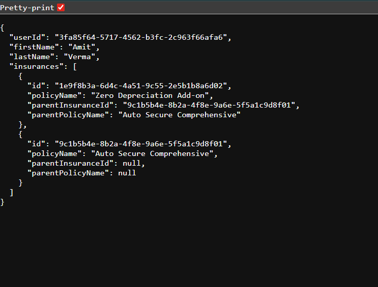

# Database Schema
There are two tables.
 -users
 -insurance

Insurance table references itself.
This is used for add-ons.

# Users Table
```
CREATE TABLE users ( id UUID PRIMARY KEY, 
first_name VARCHAR(100) NOT NULL, 
last_name VARCHAR(100) NOT NULL, 
age INT, email VARCHAR(255) UNIQUE NOT NULL, 
created_at TIMESTAMP DEFAULT NOW() ); 
```
# Insurance Table
```
CREATE TABLE insurance ( id UUID PRIMARY KEY, 
user_id UUID NOT NULL, 
policy_number VARCHAR(100) UNIQUE NOT NULL, 
policy_name VARCHAR(255) NOT NULL, 
provider_name VARCHAR(255) NOT NULL, 
coverage_amount NUMERIC(15,2) NOT NULL, 
premium_amount NUMERIC(10,2) NOT NULL, 
currency CHAR(3) DEFAULT 'INR', 
start_date DATE NOT NULL, 
end_date DATE NOT NULL, 
status VARCHAR(30) CHECK (status IN ('ACTIVE', 'EXPIRED', 'CANCELLED')), 
parent_insurance_id UUID, 
is_addon BOOLEAN DEFAULT FALSE, 
addon_type VARCHAR(100), 
addon_coverage_amount NUMERIC(15,2), 
created_at TIMESTAMP DEFAULT NOW(), 
updated_at TIMESTAMP DEFAULT NOW(), 
CONSTRAINT fk_insurance_user FOREIGN KEY (user_id) REFERENCES users(id), 
CONSTRAINT fk_parent_insurance FOREIGN KEY (parent_insurance_id) REFERENCES insurance(id) ON DELETE SET NULL, CONSTRAINT chk_addon_parent CHECK ( (is_addon = FALSE AND parent_insurance_id IS NULL) OR (is_addon = TRUE AND parent_insurance_id IS NOT NULL) ) );
```
# Api-response
Request format 

    - GET /users/:userId/insurances
Request url :

    - http://localhost:PORT/users/3fa85f64-5717-4562-b3fc-2c963f66afa6/insurances
    - 

# Tech used

    -Node.js
    -EXpress.js
    -node-postgres(https://node-postgres.com/)

